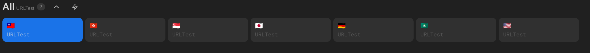
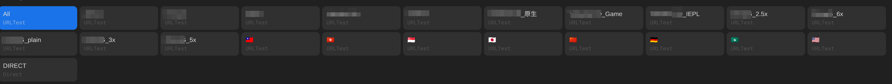

```
this is solely a project for me to practice python and learn asyncio

don't use it, unless you want to use a piece of shit

the doc bellow is solely used to prevent me from forgetting things and make the repository looks better
```

# <sub>Clash</sub>の<sup>Addons</sup>



**Selector**


## Demo

订阅: [Clash](https://clashaddons.pages.dev/clash) | [Quantumult X](https://clashaddons.pages.dev/quanx)

resources are grabbed from [here](https://proxypoolss.fly.dev/).

## 一些话

既然这个仓库被发现了，我也有做些说明的必要了。  
这是我用于对来自多个提供商的订阅节点进行整合，分类，并生成订阅文件的脚本。  
由于我蒟蒻，所以一度只得将订阅文件托管在公开的仓库中。  
于是，我的上网体验在这个仓库被注意到后受到了影响，但**这个仓库本意不是分享节点**。  
现在我将原库改为私有，使用 Cloudflare Pages 托管生成的订阅文件，并将本库改为 Template 库 ，解决了暴露节点甚至违反供应商服务条款的问题。

lhie1的规则库似乎被Github关闭了，可使用ConnersHua规则。

我的目标是将该脚本部署在 cloudflare worker 上，但缺乏 javascript 和 http request 相关知识，再加上我的生活状态之差，实现该目标遥遥无期。

----

```text
for learning purpose.
```

currently work as a part of [subconverter](https://github.com/tindy2013/subconverter).

## Usage

define config path in `smart.py` then run it.

### Configuration

[enabled it.](https://github.com/wmyfelix/ClashAddons/blob/5384cd9f90ea9eb1c543dede52be543f809f1194/omc/config-sample.yaml#L1-L44)  
